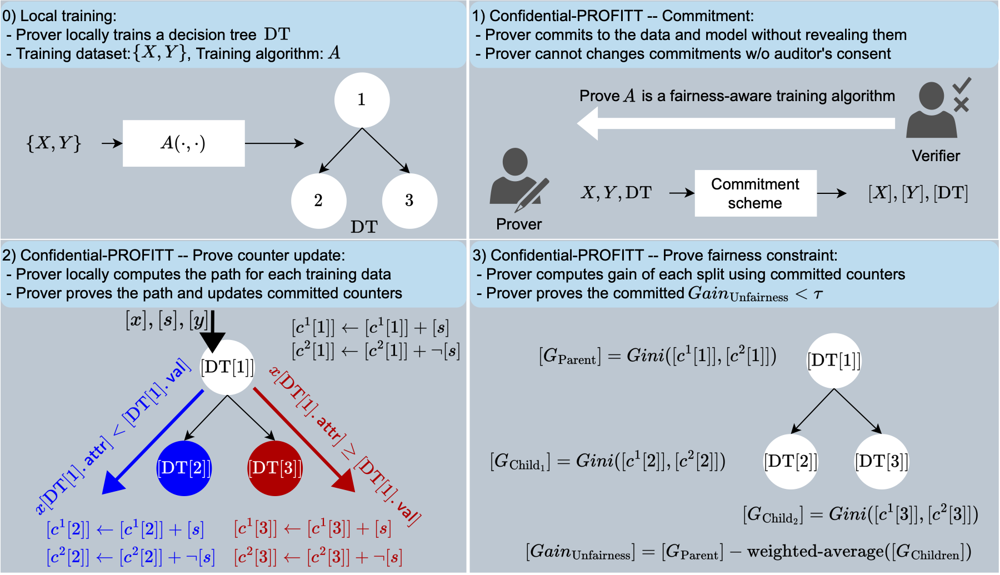

# Confidential-PROFITT

---

This is the official repository for [Confidential-Proffit: Confidential PROof of FaIr Training of Trees](https://openreview.net/pdf?id=iIfDQVyuFD), a work published in the International Conference on Learning Representations (ICLR), 2023, in Kigali, Rwanda. 



The results for this project are split into two subdirectories. The effectiveness directory contains code for testing the fairness and accuracy of fairness-aware tree training. Efficiency directory contains code for evaluating the speed and cost of Confidential-PROFITT.

## Efficiency

---

Zero-knowledge proof of fair training for decision trees.

### Replication Quick Start

Benchmarks in the paper were run using separate Amazon EC2 instances for the prover and verifier. They can also be run locally, but better performance is achieved with two instances (since the computational cost of initialising the ZK proof framework is distributed among two machines).

### Setup

1. Install emp-tool with the following command:

```
wget https://raw.githubusercontent.com/emp-toolkit/emp-readme/master/scripts/install.py && python3 install.py --install --tool --ot --zk --deps
```

1. Inside the working directory for this code (here on referred to as `cpof-main`) make auxilliary directories and compile:

```
cd cpof-main; mkdir data && mkdir experiments && mkdir temp && cmake . && make
```

1. Configure `test/experiment_config.py` by replacing `/PATH/TO/THISDIR/...` with the path to this directory on your machine.
2. If desired, use this script to throttle the connection to LAN parameters

```
wget https://raw.githubusercontent.com/emp-toolkit/emp-readme/master/scripts/throttle.py

python3 throttle.py -i ens5 -b 1000 -l 1
```

### Running experiments

1. Set parameters in `cpof/constant.py` and compile using `cmake . && make`. For the Demographic Parity version of the algorithm, set `WHICH_ALG=1` and for Equalized Odds set `WHICH_ALG=3`.
2. Run benchmark for zero-knowledge proof of fair decision tree training. To run it locally, use the following command:

```
./run bin/test_benchmark
```

To run it on separate machines, use these respective commands on 2 machines

```
./bin/test_benchmark_ONLINE 1 12345 <IP of machine 2>
```

```
./bin/test_benchmark_ONLINE 2 12345 <IP of machine 1>
```

To obtain the figures in the paper, we perform 5 runs for each parameter setting and report the median.

1. Run benchmark for zero-knowledge proof of fair random forest training. On two separate machines, use the following commands:

```
./bin/test_benchmark_RF_ONLINE 1 12345 <IP of machine 2>
```

```
./bin/test_benchmark_RF_ONLINE 2 12345 <IP of machine 1>
```

To obtain the figures in the paper, we perform 5 runs for each parameter setting and report the median.

## Effectiveness

---

Fair tree training using Gini impurity metrics. 

### Setup:

Download and place datasets into `src/main/resources/<dataset>_<seed number>.csv` for tree training. 

The code is Java (tested on Java 14) and requires maven (tested on 3.8, installation instructions [here](https://maven.apache.org/install.html)). The scripts in `sbatch_scripts/` compile to a `targets/` directory.

The plotting scripts and notebooks require python with libraries from `requirements.txt`, please install with:

```bash
pip install -r requirements.txt
```

### Running:

Alter categories in `sbatch_scripts/run.sh` for various datasets, train/test results, Gini fairness formulations, etc. `sbatch_scripts/run_baselines.sh` gives decision trees or random forests trained without fairness.

1. These categories, along with the `date` will create raw java files in `raw_txts`. This step occurs for both the `run.sh` and `baseline_run.sh` (the latter of which trains trees without fairness criteria).
2. The script will read these into `pandas.DataFrames` stored in the `results` directory under the appropriate dataset, fairness condition, date, number of seeds, and GINI formulation. These are saved as `.csv` files. This step is included in both of the aforementioned scripts.
3. These csvs can then be plotted. This step is included in the `run.sh` script and also available in a separate `plotting.sh` script if you'd only like to plot. Plots are generated in the same directory as their csvs in a `<csv dir here>/plots/` subdirectory.
4. Other plots (the ones in the paper) are computed in Jupyter notebooks (in `notebooks/`). Accuracy vs unfairness plots are in `acc_v_fair.ipynb` and IGS (unfairness info gain) plotting in `IGS_plotting.ipynb`

This portion of the code builds on [Fair-Forest](https://github.com/jfantinhardesty/Fair-Forest) by James Fantin which is an extension of a paper: "[Fair forests: Regularized tree induction to minimize model bias](https://arxiv.org/abs/1712.08197)." Proceedings of the 2018 AAAI/ACM Conference on AI, Ethics, and Society. 2018. This code also extends the JSAT (Java Statistical Analysis Tool) by Edward Raff ([paper](https://www.jmlr.org/papers/v18/16-131.html), [repo](https://github.com/EdwardRaff/JSAT)) under the GPL-3.0 License.

## Authors

- [Ali Shahin Shamsabadi](https://alishahin.github.io/)
- [Sierra Wyllie](https://www.syntelliga.net/)
- [Nicholas Franzese](https://granoia.github.io/)
- [Natalie Dullerud](https://ndullerud.github.io/)
- [Sébastien Gambs](https://professeurs.uqam.ca/professeur/gambs.sebastien/)
- [Nicolas Papernot](https://www.papernot.fr/)
- [Xiao Wang](https://wangxiao1254.github.io/)
- [Adrian Weller](https://mlg.eng.cam.ac.uk/adrian/)

## Cite as:

```bash
@inproceedings{
	shamsabadi2023confidentialprofitt,
	title={Confidential-{PROFITT}: Confidential {PRO}of of FaIr Training of Trees},
	author={Ali Shahin Shamsabadi and Sierra Calanda Wyllie and Nicholas Franzese and Natalie Dullerud and S{\'e}bastien Gambs and Nicolas Papernot and Xiao Wang and Adrian Weller},
	booktitle={The Eleventh International Conference on Learning Representations },
	year={2023},
	url={https://openreview.net/forum?id=iIfDQVyuFD}
}
```